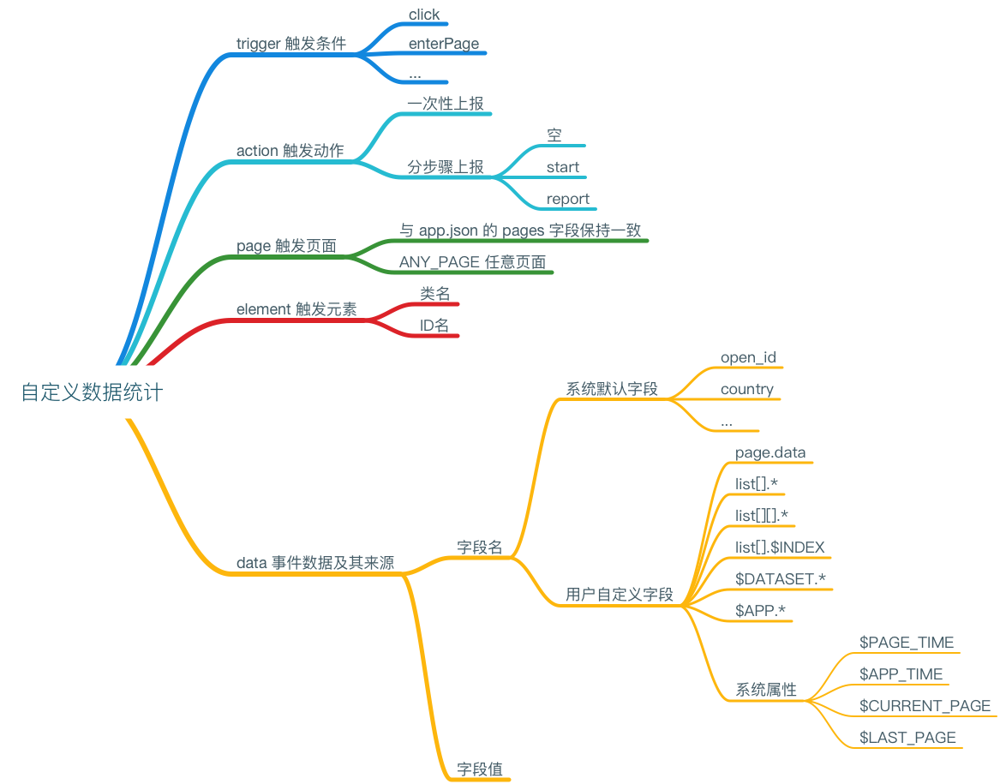

# 自定义数据统计

[](https://raw.githubusercontent.com/liuzhuan/wx-app/master/assets/data-analysis.png)

主要通过小程序管理后台的【数据分析】-->【自定义分析】-->【事件管理】进行创建和管理。

需要注意的是：

* 自定义字段是全局唯一的。
* 事件名称也是全局惟一的。

事件由以下部分组成：

- trigger 触发条件
- action 触发时的动作
- page 触发页面
- element 触发元素
- data 事件的数据及其来源，用“字段名 字段值”表示

## action

一次性上报：一次触发上报一条数据记录

分步骤上报：

- 空 只收集数据
- start 初始化并收集数据
- report 收集数据并上报事件数据

**注：每次 report 前必须有 start 操作，未经过 start 操作不会上报。**

## page 触发页面

与 app.json 的 pages 字段保持一致，如果要任意页面触发，则填写 `ANY_PAGE`。

## data 自定义数据

字段名：事件里的字段名
字段值：用于收集小程序中的变量，规则如下：

- 变量名，从 page 实例的 data 字段中获取
- 若想收集由 list 变量渲染的列表中的某一项数据，则可用 `list[].*` 表示，这里会根据当前填写的 element（只能是class）得到的 `NodeList` 的第几个来决定数组下标。
- 若列表是二维的，则可用 `list[][].*` 表示，这里 element 需填写两个 class（空格隔开）分别表示父列表与子列表。
- 若想取得数组的下标，则可用 `list[].$INDEX` 表示
- 若想取得 wxml 中 `data-` 系列属性的值，则可用 `$DATASET.` 表示
- 若想取得 app 实例的数据，则可用 `$APP.*` 表示，只支持获取基本类型的数据，如`number`、`string`、`boolean`。

除此之外，还可以填写一些提供的系统属性，以“$”开头，目前支持以下属性：

- `$PAGE_TIME` 用户从进入本页面到当前的时间(触发action的时间点)
- `$APP_TIME` 用户进入小程序到当前的时间(触发action的时间点)
- `$CURRENT_PAGE` 当前用户所在的页面
- `$LAST_PAGE` 上一页

## 系统默认数据

| 字段 | 中文名称 | 类型 | 备注 |
| --- | --- | --- | --- |
| open_id | OpenID | string | |
| country | 国家 | string | |
| province | 省份 | string | |
| city | 城市 | string | |
| gender | 性别 | string | 男、女、其他 |
| device | 设备类型 | string | |
| network_type | 网络类型 | string | |
| device_width | 屏幕宽度 | string | |
| device_height | 屏幕高度 | string | |
| os_name | 操作系统名 | string | |
| os_version | 操作系统版本 | string | |
| language | 系统语言 | string | |
| manufacturer | 设备制造商 | string | |
| device_model | 设备型号 | string | |
| device_brand | 设备品牌 | string | |
| page_path | 页面路径 | string | |

## 使用 API 进行上报

- 根据需要添加字段
- 保存进入下一步
- 在代码中使用 API 进行上报
- 点击“生成代码”生成API上报示例代码

```js
wx.reportAnalytics('purchase', {
  price: 120,
  color: 'red'
})
```

## REF

- https://mp.weixin.qq.com/debug/wxadoc/analysis/custom/
- https://mp.weixin.qq.com/debug/wxadoc/dev/api/analysis-report.html